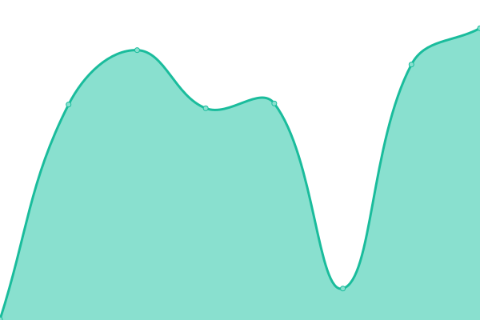
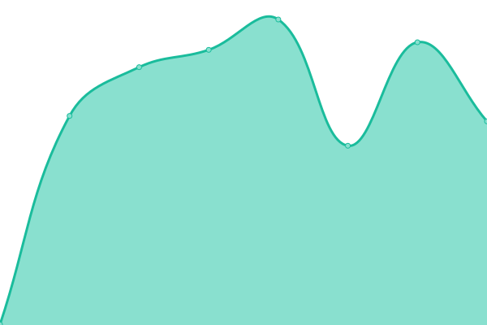

# [📈 Live Status](https://knowtilus.github.io/upptime): <!--live status--> **🟩 All systems operational**

This repository contains the open-source uptime monitor and status page for [knowtilus](https://knowtilus.github.io/upptime), powered by [Upptime](https://github.com/upptime/upptime).

With [Upptime](https://upptime.js.org), you can get your own unlimited and free uptime monitor and status page, powered entirely by a GitHub repository. We use [Issues](https://github.com/knowtilus/upptime/issues) as incident reports, [Actions](https://github.com/knowtilus/upptime/actions) as uptime monitors, and [Pages](https://knowtilus.github.io/upptime) for the status page.

<!--start: status pages-->
<!-- This summary is generated by Upptime (https://github.com/upptime/upptime) -->
<!-- Do not edit this manually, your changes will be overwritten -->
<!-- prettier-ignore -->
| URL | Status | History | Response Time | Uptime |
| --- | ------ | ------- | ------------- | ------ |
|  [knowtilus](https://www.knowtil.us) | 🟩 Up | [knowtilus.yml](https://github.com/knowtilus/upptime/commits/HEAD/history/knowtilus.yml) | 

 446ms
     
 | 

<a href="https://status.knowtil.us/history/knowtilus">100.00%</a>
    

|  [emanbae](https://www.emanbae.com) | 🟩 Up | [emanbae.yml](https://github.com/knowtilus/upptime/commits/HEAD/history/emanbae.yml) | 

 442ms
     
 | 

<a href="https://status.knowtil.us/history/emanbae">100.00%</a>
    

|  API | 🟩 Up | [api.yml](https://github.com/knowtilus/upptime/commits/HEAD/history/api.yml) | 

 724ms
     
 | 

<a href="https://status.knowtil.us/history/api">100.00%</a>
    

<!--end: status pages-->

[**Visit our status website →**](https://knowtilus.github.io/upptime)

## 📄 License

- Powered by: [Upptime](https://github.com/upptime/upptime)
- Code: [MIT](./LICENSE) © [knowtilus](https://knowtilus.github.io/upptime)
- Data in the `./history` directory: [Open Database License](https://opendatacommons.org/licenses/odbl/1-0/)
